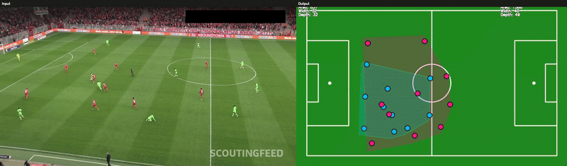
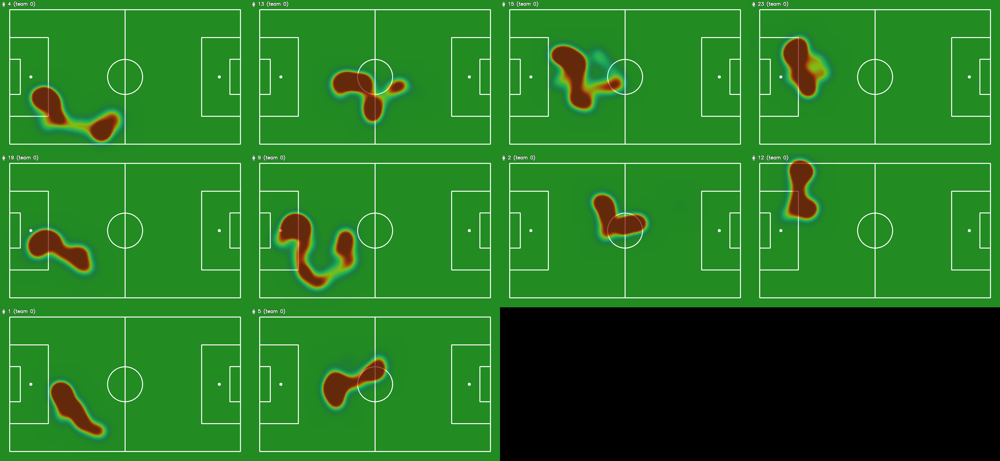
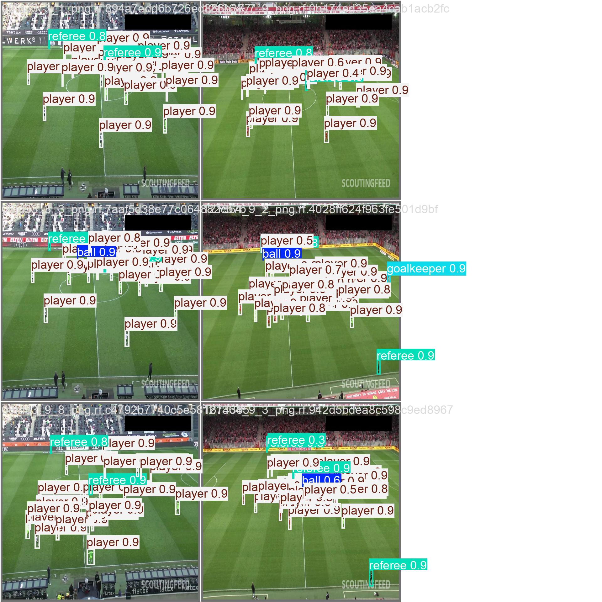
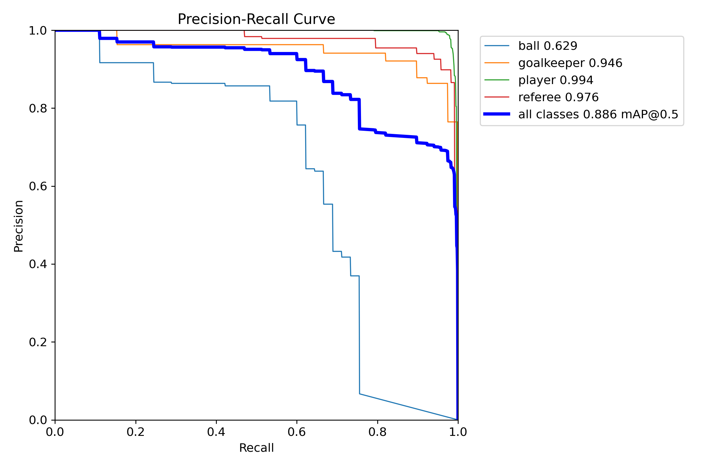
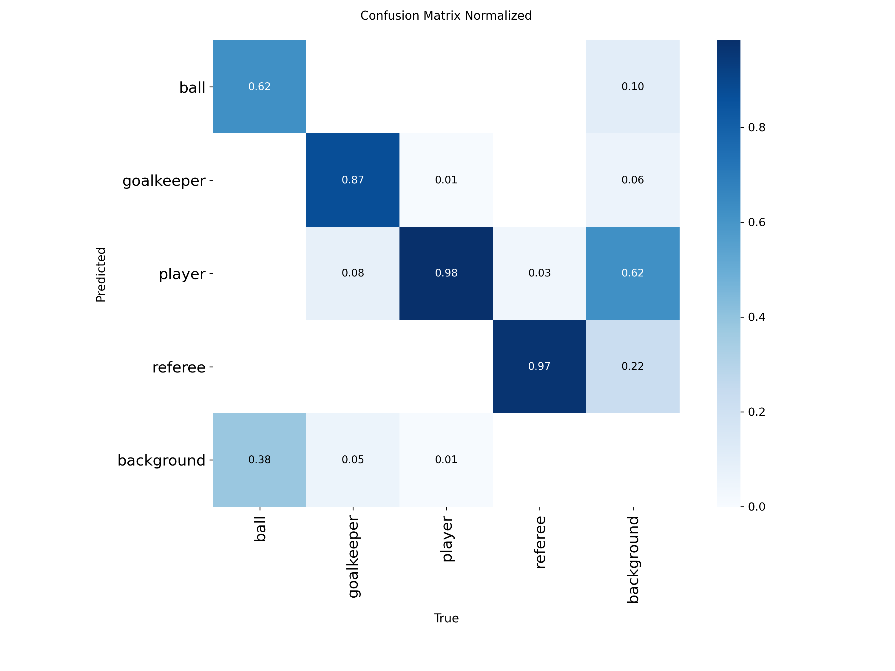
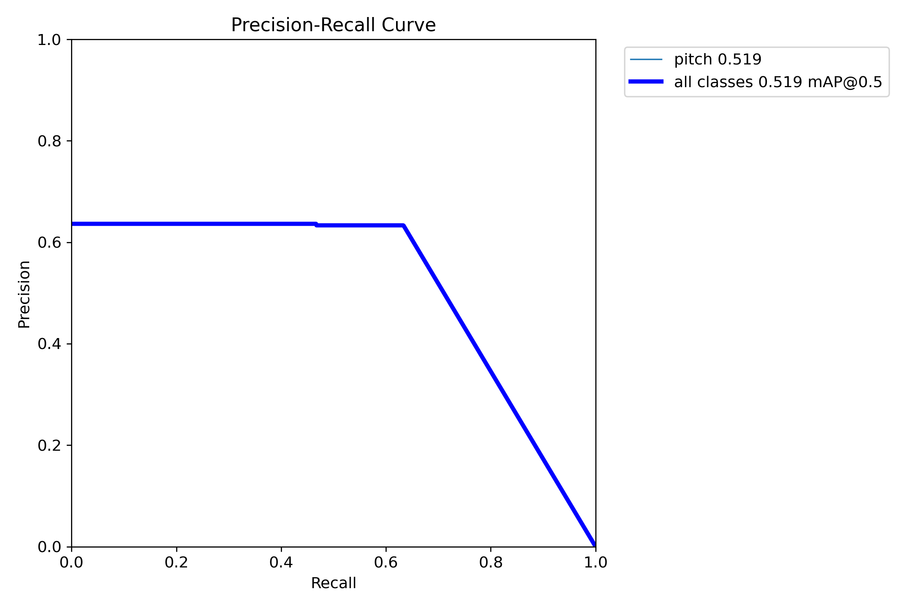
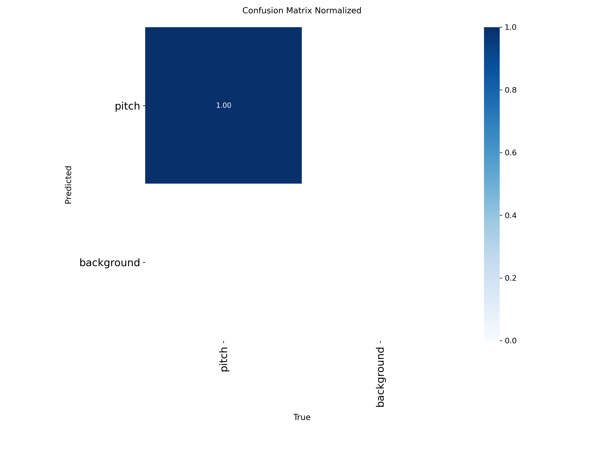

# soccer-cv

[](https://pypi.org/project/soccer-cv/)
[](https://pypi.org/project/soccer-cv/)
[](LICENSE)
[](https://pypi.org/project/soccer-cv/)
[](https://colab.research.google.com/github/granthohol/soccer-cv/blob/main/notebooks/quickstart.ipynb)

### A python library that converts raw video into rich soccer metrics and visuals, no external data required

##### 3D -> 2D with Team Shape


##### Player Heatmaps (Defense)



##### Player Kinetic Data
|   team_id_mode |   track_id |   total_distance_m |   distance_per_min_m |   mean_speed_m_s |   median_speed_m_s |   p95_speed_m_s |   max_speed_m_s |   hi_time_s |   sprint_time_s |   hi_distance_m |   accel_events |   max_accel_mag_m_s2 |   stops |
|---------------:|-----------:|-------------------:|---------------------:|-----------------:|-------------------:|----------------:|----------------:|------------:|----------------:|----------------:|---------------:|---------------------:|--------:|
|              0 |          6 |              78.78 |               157.77 |             1.94 |               1.7  |            3.85 |            5.31 |        0.6  |            0    |            3.11 |              3 |                27.65 |       4 |
|              0 |          9 |             107.11 |               214.51 |             2.7  |               2.8  |            4.92 |            5.32 |        1.28 |            0    |            6.67 |              0 |                 5.1  |       1 |
|              0 |         15 |              61    |               122.16 |             1.56 |               1.47 |            3.71 |            4.18 |        0    |            0    |            0    |              0 |                 6.55 |       3 |
|              0 |         16 |              54.41 |               108.96 |             1.41 |               1.22 |            3.26 |            3.49 |        0    |            0    |            0    |              0 |                 7.53 |       5 |
|              0 |         17 |              83.24 |               166.71 |             2.45 |               1.73 |            6.05 |            6.84 |        2.16 |            0    |           13.55 |              2 |                14.95 |       1 |
|              0 |         19 |              59.88 |               119.92 |             1.55 |               1.57 |            2.53 |            4.46 |        0    |            0    |            0    |              1 |                 8.28 |       1 |
|              0 |         20 |             122.53 |               245.39 |             3.57 |               3.53 |            6.23 |            7.57 |        6.52 |            0.48 |           37.37 |              3 |                21.64 |       2 |
|              0 |         28 |              60.19 |               155.4  |             2.36 |               2.07 |            6.54 |            7.77 |        1.92 |            0.92 |           12.97 |              1 |                15.92 |       2 |
|              0 |         31 |              43.06 |               121.65 |             1.52 |               1.45 |            2.74 |            3.37 |        0    |            0    |            0    |              0 |                 3.81 |       3 |
|              0 |         34 |              34.51 |               136.21 |             2.06 |               1.45 |            5.9  |            7.44 |        1.28 |            0.28 |            8.08 |              1 |                25.51 |       1 |
|              1 |          1 |              77.92 |               156.06 |             2.19 |               2.12 |            4.46 |            5.18 |        0.72 |            0    |            3.69 |              1 |                 8.24 |       1 |
|              1 |          2 |              50.72 |               114.23 |             1.33 |               1.08 |            3    |            3.35 |        0    |            0    |            0    |              0 |                 6.8  |       4 |
|              1 |          3 |              89.03 |               178.29 |             2.35 |               2.27 |            4.37 |            5.23 |        0.68 |            0    |            3.5  |              3 |                 7.47 |       1 |
|              1 |          4 |              53.58 |               217.82 |             2.7  |               2.79 |            4.3  |            4.67 |        0    |            0    |            0    |              2 |                10.82 |       0 |
|              1 |          8 |              98.31 |               196.89 |             2.72 |               2.97 |            5.24 |            5.82 |        1.88 |            0    |           10.34 |              2 |                 8.58 |       1 |
|              1 |         11 |              91.86 |               183.96 |             2.29 |               2.07 |            4.28 |            4.74 |        0    |            0    |            0    |              2 |                 4.8  |       3 |
|              1 |         12 |              67.89 |               135.95 |             1.85 |               1.59 |            3.64 |            3.84 |        0    |            0    |            0    |              1 |                 7.01 |       1 |
|              1 |         14 |             100.06 |               200.38 |             2.68 |               2.6  |            5.82 |            6.62 |        2.16 |            0    |           13.13 |              0 |                 7.82 |       1 |
|              1 |         18 |              81.4  |               163.02 |             2.17 |               1.57 |            5.46 |            5.82 |        2.52 |            0    |           13.79 |              2 |                 6.34 |       2 |
|              1 |         21 |              90.42 |               181.09 |             2.41 |               2.32 |            4.68 |            5.09 |        0.52 |            0    |            2.63 |              0 |                 6.8  |       2 |


# Functionality
### What this library does
Analyst-style visuals and data extraction from ordinary footage. Can be used at any level by anyone. Some examples include:
- Visualize players, ball, refs on a canonical 2d layout. Can overlay with team shape, team control voronoi diagram, posession HUD, etc.
- Player and team heatmaps
- Tracking ball path over time
- Extracting player kinetic data over time such as position, speed, acceleration, etc.

Formats functionality as extensible pipelines. Each function can be imported and run with no needed input besides a video. 

**Fastest way to try it:** open [`notebooks/quickstart.ipynb`](notebooks/quickstart.ipynb) in Colab (badge above) — it installs the library and runs three pipelines on the bundled sample clip in a few minutes, no local setup required.

### Pipelines at a glance
```python
# Team Control in 2D layout
# You can run this by cloning this repo or downloading the library and sample video
from soccer_cv.pipelines.team_shape import write_team_shape_video
write_team_shape_video("media/121364_0.mp4", "team_shape_121364_0.mp4")
```

### How it works (brief)
1. Detect players, refs, ball, and pitch keypoints in each frame with self-trained YOLOv8 models (weights: https://huggingface.co/granthohol/soccer-cv-weights/tree/main
2. Track players/refs with ByteTrack to get persistent `track_ids`; smooth each ID’s trajectory with a constant-velocity Kalman filter (distance-gated) to stabilize positions/velocities/accelerations in field units.
3. Classify teams per track_id using a lightweight color-based team classifier trained from early crops; cache a `track_id` → `team_id` map.
4. Estimate homography from detected pitch keypoints and smooth it over time.
5. Project bottom-center anchors through the homography to the canonical 2D pitch (and convert to meters).
6. Render the chosen visualization (Voronoi, heatmaps, shapes, tracking) and derive metrics (possession, speed/accel, control %, etc.).  


# Models & Training
Both detection models were self-trained (not off-the-shelf) and are versioned in this repo under [`models/`](models/), including the raw training scripts and validation results. Weights auto-download from [Hugging Face](https://huggingface.co/granthohol/soccer-cv-weights/tree/main) on first use, so none of this is required to *use* the library — it's here for anyone who wants to see how the models were built or retrain on their own data.

### Object detection — players, goalkeepers, referees, ball
- Base model: `yolov8s.pt`, fine-tuned for 100 epochs at 1280px (Adam, lr0=1e-3) on a Roboflow football-players-detection dataset.
- 4 classes: `ball`, `goalkeeper`, `player`, `referee`.
- Training script: [`models/object_detection/train_object_detector.py`](models/object_detection/train_object_detector.py)

<table>
<tr>
<td><br/><sub>Validation predictions</sub></td>
<td><br/><sub>Precision-Recall curve</sub></td>
<td><br/><sub>Normalized confusion matrix</sub></td>
</tr>
</table>

### Pitch keypoint detection
- Base model: `yolov8x-pose.pt` (keypoint task), fine-tuned for 100 epochs on a Roboflow football-field-detection dataset.
- Detects pitch line-intersection keypoints, which drive the frame → canonical-2D-pitch homography used by every pipeline.
- Training script: [`models/pitch_detection/train_pitch_detection.py`](models/pitch_detection/train_pitch_detection.py)

<table>
<tr>
<td><br/><sub>Precision-Recall curve</sub></td>
<td><br/><sub>Normalized confusion matrix</sub></td>
</tr>
</table>


# Installation

### 1. Requirements
- Python 3.10-3.12
- OS: Linux (tested). macOS and Windows should work but are less exercised.
- Tools: git

### 2. Choose your PyTorch backend

##### GPU CUDA (recommended if available)
```bash
pip install --index-url https://download.pytorch.org/whl/cu121 torch torchvision
pip install "sports@git+https://github.com/roboflow/sports.git@main"
pip install  "soccer-cv[cuda]"
```

##### CPU
```bash
pip install --index-url https://download.pytorch.org/whl/cpu torch torchvision
pip install "sports@git+https://github.com/roboflow/sports.git@main"
pip install "soccer-cv[cpu]"
```

##### Apple Silicon
```bash
pip install torch torchvision
pip install "sports@git+https://github.com/roboflow/sports.git@main"
pip install "soccer-cv[mps]"
```

### 3. Weights (auto-download)
On first use, models auto-download from Hugging Face
- Cached under your HF cache (e.g. `~/.cache/huggingface`).
- If you prefer manual download, place the `.pt` files where the enviornment's HF cache can see them.


# Limitations
- **Single, fairly wide broadcast-style camera.** Homography estimation needs enough visible pitch line markings in frame; tight replays, handheld/sideline footage, or frequent camera cuts will degrade or break pitch keypoint detection and the 2D projection.
- **Binary team classification.** The team classifier assumes two visually distinct outfield kit colors. It struggles when a goalkeeper's kit is close to an outfield team's color, kits are similar, or the ball/broadcast graphics occlude the crop it classifies from.
- **Possession is a heuristic, not event data.** It's computed as nearest-player-to-ball distance in pitch space within a fixed radius — a good proxy for a possession bar, not a substitute for annotated touch/pass events.
- **No cross-shot re-identification.** Track IDs (and therefore team assignment) reset on hard camera cuts, so pipelines are built around continuous single-shot clips rather than a full match broadcast.
- **Trained on a modest public dataset.** Both YOLOv8 models (see [Models & Training](#models--training)) were fine-tuned on a few thousand annotated broadcast frames — expect accuracy to drop on unusual lighting, non-broadcast camera angles, or lower resolutions than they were trained on.
- **CPU inference is slow.** Everything runs on CPU, but at ~1280px input a CUDA or Apple-Silicon (MPS) GPU is recommended for anything beyond short clips.


